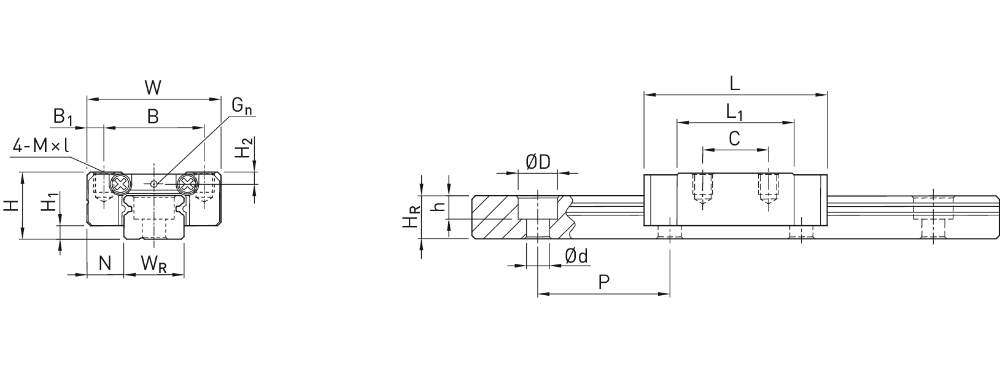
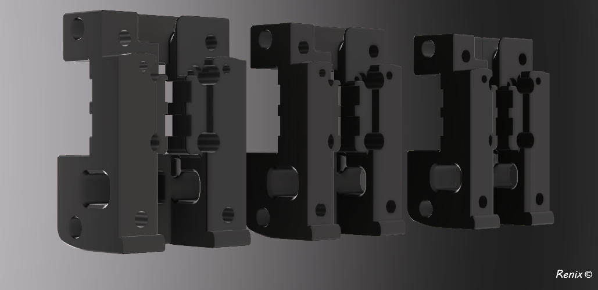
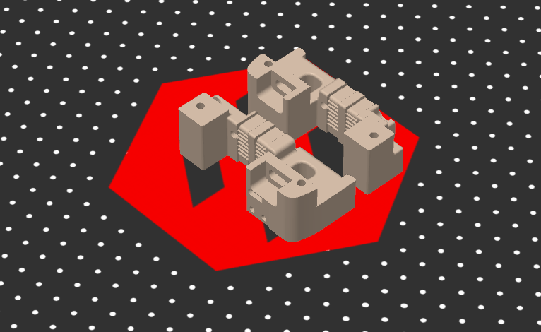

<h2>X Carriage</h2>

Modified X Carriage CW2 for V2.4 R2 with 1x linear rail (Hiwin MGN12/CPC MR12M/LDO) at X Axis. 
This adjustment was necessary, because the sleds all have a different width.
As an example here:
## Picture:

```
Hiwin: L 45,4mm
CPC: L 48mm
```
## X Endstop midification of position
Furthermore, the position of the X switch on the carriage was adjusted. This has a too wide distance to the XY-Joint. 
At the limit switch, the tab must be bent up strongly to overcome approx. 5mm distance.
This adjustment should minimize or eliminate this problem.

###### Additional information:
Only important for users of the Umbilical. Otherwise, the standard position on the XY-Joint can still be used for the X and Y end stops. 

## Picture:


## Print direction:



Origin of Files:
[Voron-2.4R2](https://github.com/VoronDesign/Voron-2)	
[Voron-Stealthburner](https://github.com/VoronDesign/Voron-Stealthburner)