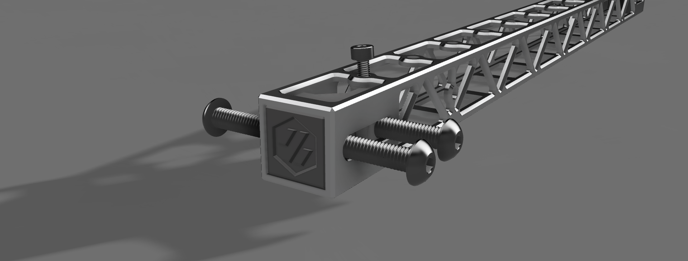

<h2>Pins Mod XY Joints for X Beam Light & Ultra Light</h2>

Modified XY Joints for V2.4 R2 with 1x MGN12 at X Axis in combination with the X-Lite & X-UltraLite from [WKS-3D](https://wks-3d.de/) .
The centering lugs must be removed from the XY joints. Here you can download the correct STL files.

For better assembly use the assamble tool Aluminium Hexnut Insert.
## Picture:

The Mod is based on hartk1213 
[hartk1213](https://github.com/hartk1213/MISC/tree/main/Voron%20Mods/Voron%202-Trident/2.4/Voron2.4_Trident_Pins_Mod)

Origin of Files:
[kostja89](https://github.com/kostja89/WKS-3D)	
